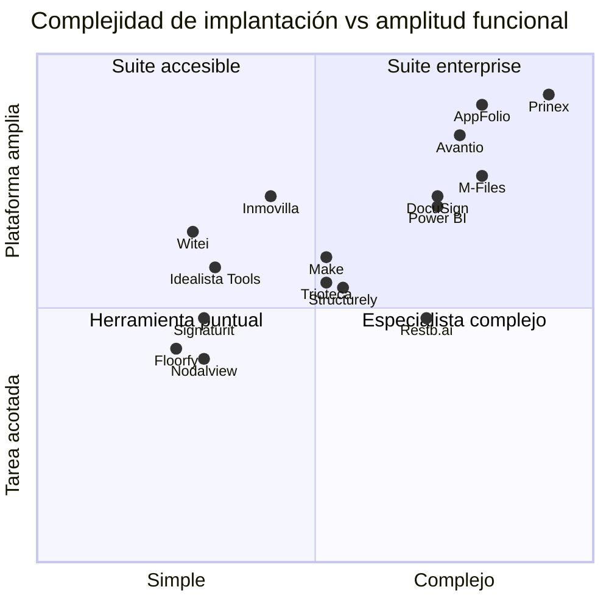
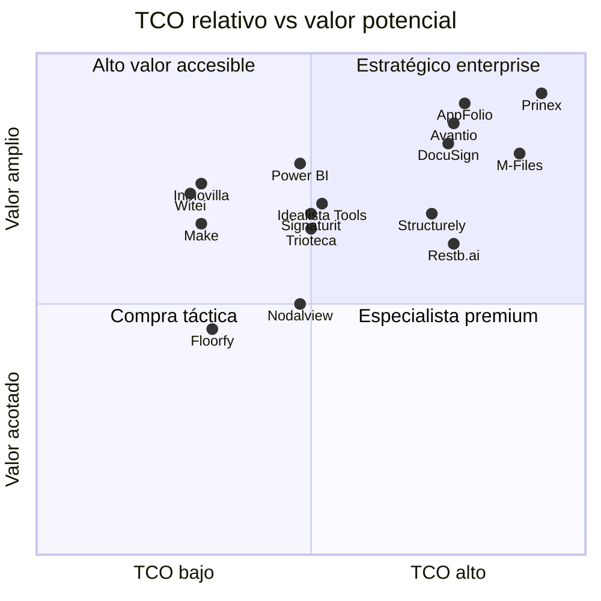
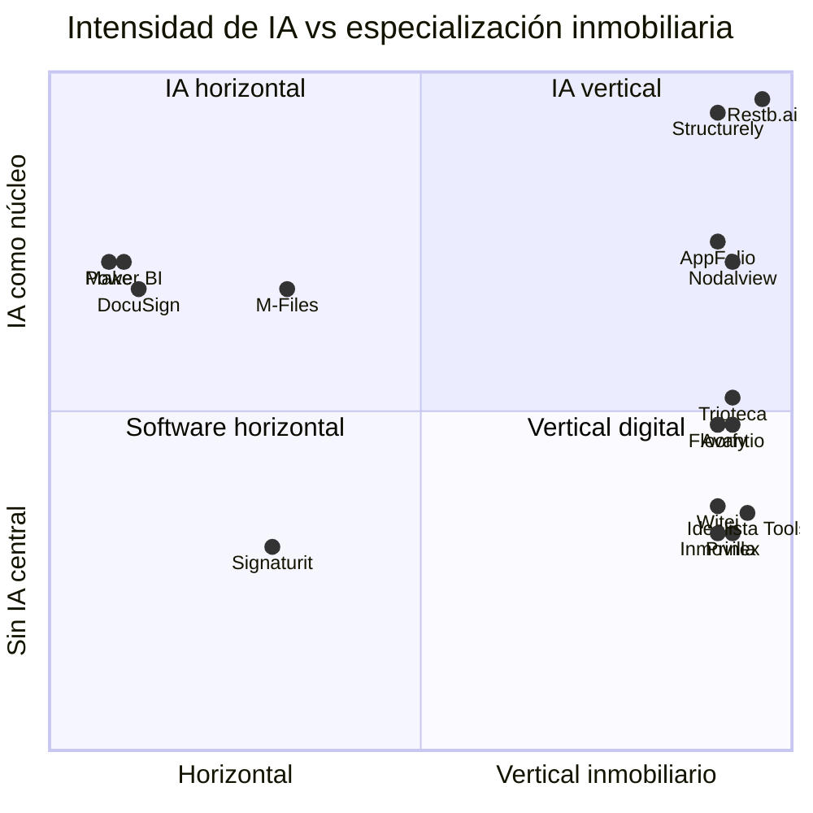

# Mapa de posicionamiento

## Método

Puntuación analítica ordinal, no métrica de rendimiento:

- **Complejidad:** 1 = autoservicio/tarea única; 5 = implantación enterprise/múltiples procesos.
- **Precio/TCO:** 1 = entrada gratuita o baja; 5 = presupuesto enterprise, integración y servicios.
- **IA:** 1 = sin IA central; 5 = IA vertical/agéntica como núcleo.
- **Especialización:** 1 = horizontal; 5 = vertical inmobiliario.
- **Valor potencial:** amplitud y criticidad del proceso cubierto, no ROI demostrado.

## 1. Tabla de codificación

| Empresa | Complejidad | TCO | IA | Especialización | Valor potencial |
|---|:---:|:---:|:---:|:---:|:---:|
| Inmovilla | 3 | 2 | 2 | 5 | 4 |
| Witei | 2 | 2 | 2 | 5 | 4 |
| idealista/tools | 2 | 3 | 2 | 5 | 4 |
| Prinex | 5 | 5 | 2 | 5 | 5 |
| Floorfy | 2 | 2 | 3 | 5 | 3 |
| Nodalview | 2 | 3 | 4 | 5 | 3 |
| Signaturit | 2 | 3 | 2 | 2 | 4 |
| DocuSign | 4 | 4 | 4 | 1 | 5 |
| Avantio | 4 | 4 | 3 | 5 | 5 |
| AppFolio | 4 | 4 | 4 | 5 | 5 |
| Trioteca | 3 | 3 | 3 | 5 | 4 |
| M-Files | 4 | 5 | 4 | 2 | 5 |
| Power BI | 4 | 3 | 4 | 1 | 5 |
| Make | 3 | 2 | 4 | 1 | 4 |
| Structurely | 3 | 4 | 5 | 5 | 4 |
| Restb.ai | 4 | 4 | 5 | 5 | 4 |

**Confianza:** media. Las puntuaciones sintetizan producto, contratación y esfuerzo de adopción; el TCO real no es público para la mayoría.

## 2. Complejidad frente a simplicidad

## 3. Precio/TCO frente a valor potencial

El “valor” es potencial funcional. No implica que el cliente obtenga retorno; datos deficientes pueden reducir drásticamente el valor de BI, automatización e IA.

## 4. Nivel de IA frente a especialización

## 5. Implicaciones

1. **Verticales españoles:** alto encaje inicial y menor complejidad, pero IA y gobierno de datos desiguales.
2. **Suites enterprise:** mayor amplitud, coste de implantación y dependencia de configuración.
3. **IA vertical:** gran especialización técnica; el reto competitivo se desplaza a integración, idioma, normativa y volumen.
4. **Plataformas horizontales:** menor conocimiento inmobiliario nativo, pero ecosistemas y capacidad de extensión superiores.
5. **Especialistas de contenido/firma:** adopción sencilla en una tarea; no eliminan la fragmentación si el resultado vuelve manualmente al CRM.

## 6. Pendientes

- TCO comparable a 12 y 36 meses.
- Tiempo de implantación y porcentaje de clientes que usan cada módulo.
- Disponibilidad real de IA por país, idioma y plan.
- Benchmark técnico de APIs, latencia, errores y exportabilidad.
- Valor observado por arquetipo de agencia.
