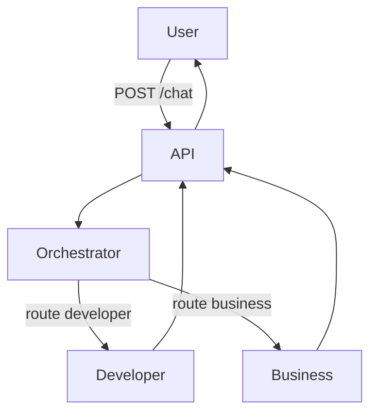

# Arquitectura — Fase 1

## Flujo



1. El usuario envía un mensaje a la API.
2. La API carga el prompt del Orchestrator y llama al LLM.
3. El Orchestrator responde con el agente destino (`developer` o `business`) y un motivo.
4. La API carga el prompt de ese agente, le pasa el mensaje original y obtiene la respuesta.
5. La API devuelve `routed_to` + `reply`.

No hay bucles, memoria ni herramientas en esta fase: un mensaje → una ruta → una respuesta.

## Mapa de carpetas

Todo relativo a la **raíz del repositorio** (no hay carpeta `business-ai/`).

Convención: cada agente es una carpeta con un `system.md` (prompt). Sin frameworks de agentes.

```
agents/
├── orchestrator/
│   └── system.md
├── developer/
│   └── system.md
└── business/
    └── system.md

api/                  # FastAPI: endpoint /chat y cliente LLM
tests/                # prueba manual o script mínimo (opcional en Fase 1)
docs/
├── roadmap/
│   └── fase_1.md
└── fase_1/           # esta guía
```

Notas:

- En el árbol completo del roadmap existen `sales`, `marketing`, etc. En Fase 1 usamos **`business/`** como rol unificado.
- `knowledge/`, `memory/`, `tools/` y `workflows/` ya pueden existir en la raíz; el MVP de Fase 1 no los usa todavía.

## Capas mínimas de código

| Pieza | Responsabilidad |
|-------|-----------------|
| Carga de prompts | Leer `agents/<nombre>/system.md` |
| Cliente LLM | Una función: system + user → texto |
| Router | Orchestrator → parsear JSON → elegir agente |
| API | `POST /chat` orquesta los dos pasos |

## Límite de complejidad

Si el flujo necesita “si A entonces Developer, si responde X entonces Finance…”, aún no es Fase 1: eso es orquestación con estados (más adelante, LangGraph cuando haga falta).
