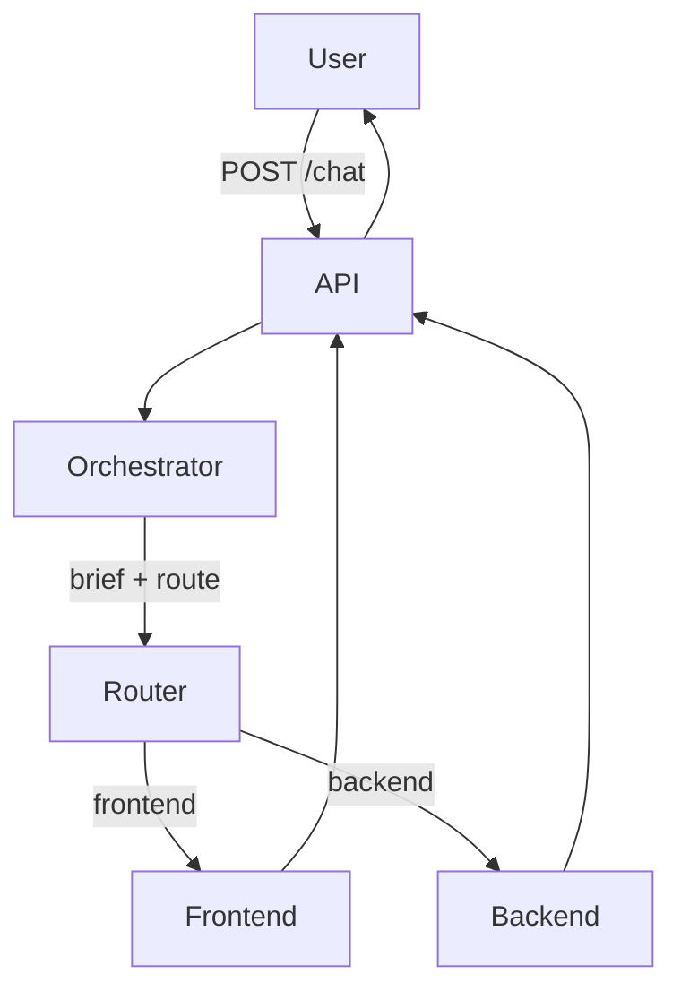

# Arquitectura — Fase 1

## Flujo



1. El usuario envía un mensaje a la API.
2. La API carga el prompt del Orchestrator y llama al LLM.
3. El Orchestrator responde con JSON: `agent` (`frontend`|`backend`), `reason` y `brief` (documentación).
4. La API carga el prompt del agente elegido, le pasa el mensaje **y** el `brief`, y obtiene la respuesta de implementación.
5. La API devuelve `routed_to`, `documentation` (= `brief`), `reply` y `reason`.

No hay bucles, memoria ni herramientas en esta fase: un mensaje → documentar + una ruta → una respuesta de implementación.

## Mapa de carpetas

Todo relativo a la **raíz del repositorio** (no hay carpeta `business-ai/`).

Convención: cada agente es una carpeta con un `system.md` (prompt). Sin frameworks de agentes.

```
agents/
├── orchestrator/
│   └── system.md
├── frontend/
│   └── system.md
└── backend/
    └── system.md

api/                  # FastAPI: endpoint /chat y cliente LLM
tests/
docs/
├── roadmap/
│   └── fase_1.md
└── fase_1/           # esta guía
```

Notas:

- En el árbol amplio del repo pueden existir `sales`, `marketing`, `developer`, etc. El MVP documentado usa **`orchestrator`**, **`frontend`** y **`backend`**.
- `knowledge/`, `memory/`, `tools/` y `workflows/` pueden existir en la raíz; el MVP de Fase 1 no los usa todavía.

## Capas mínimas de código

| Pieza | Responsabilidad |
|-------|-----------------|
| Carga de prompts | Leer `agents/<nombre>/system.md` |
| Cliente LLM | Una función: system + user → texto |
| Router | Orchestrator → parsear JSON (`agent`, `brief`) → elegir agente |
| API | `POST /chat` orquesta documentar + implementar |

## Límite de complejidad

Si el flujo necesita “documentar → Frontend → Backend → unir respuesta”, aún no es este MVP: eso es orquestación multi-paso (más adelante, LangGraph cuando haga falta).
