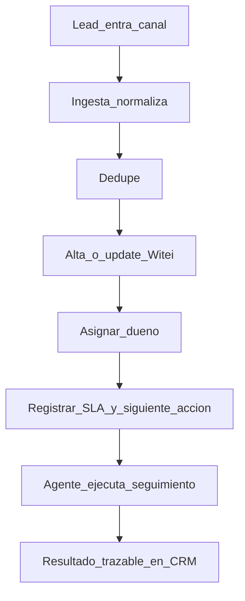

# 02 — Flujo

Contexto de mercado (lead→postventa): [flujo-lead-postventa.md](../Orquestacion-Leads-Agencias/ecosistema_tecnologico/01_arquitectura_y_flujos/flujo-lead-postventa.md).  
Este MVP cubre solo **entrada → registro → dueño → SLA → siguiente acción → excepción**.

## Happy path

1. Entra un lead por el canal acordado (portal o web).
2. Se normalizan identidad mínima y origen.
3. Se aplica deduplicación (ver [05-reglas.md](05-reglas.md)).
4. Se crea o actualiza el registro en Witei.
5. Queda **responsable**, **SLA** (p. ej. primera respuesta) y **siguiente acción**.
6. El agente humano trabaja; el resultado (contactado, visita, descartado, etc.) queda en el CRM.

## Excepciones

| Caso | Detección | Acción |
|---|---|---|
| Sin dueño tras alta | Campo responsable vacío pasado umbral | Cola excepción + alerta |
| SLA roto | `now > deadline` sin resultado de 1ª respuesta | Reasignar o escalar según regla |
| Duplicado | Mismo email/teléfono/origen-id en ventana | Merge o link; no crear segundo dueño |
| Datos insuficientes | Falta email y teléfono | Cola excepción; no asignar a ciegas |
| Fallo de sync | Error iPaaS/API / timeout | Reintento acotado + cola + log |
| Actividad fuera del CRM | Se detecta solo en revisión humana | Documentar; fuera de automatización MVP |

## Qué no automatiza este flujo

- Cualificación profunda de intención de compra.
- Conversación WhatsApp personal.
- Cierre, hipoteca, expediente.

## Criterio de diseño

Toda automatización termina en **estado visible en CRM** o en **cola humana**. No hay “caja negra” sin owner.
