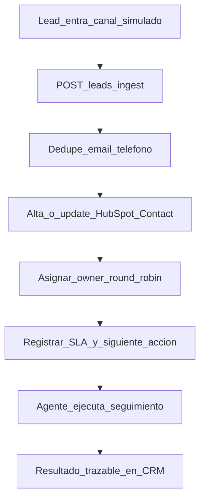

# 02 — Flujo

Contexto de mercado (lead→postventa): [flujo-lead-postventa.md](../Orquestacion-Leads-Agencias/ecosistema_tecnologico/01_arquitectura_y_flujos/flujo-lead-postventa.md).  
Este MVP cubre solo **entrada → registro → dueño → SLA → siguiente acción → excepción**.

## Happy path (lab HubSpot)

1. Entra un lead por el canal acordado (en lab: payload JSON a `/leads/ingest`).
2. Se normalizan identidad mínima y origen.
3. Se aplica deduplicación (ver [05-reglas.md](05-reglas.md)).
4. Se crea o actualiza el **Contact** en HubSpot con propiedades custom.
5. Queda **owner** (`hubspot_owner_id`), **SLA** (`sla_primera_respuesta_at`) y **siguiente acción**.
6. El agente humano trabaja; el resultado queda en el CRM.

Implementación: [`api/leads/orchestrator.py`](../../../api/leads/orchestrator.py).

## Excepciones

| Caso | Detección | Acción |
|---|---|---|
| Sin dueño tras alta | Campo responsable vacío pasado umbral | Cola excepción + alerta |
| SLA roto | `now > deadline` sin resultado de 1ª respuesta | Reasignar o escalar según regla |
| Duplicado | Mismo email/teléfono | Update; conservar owner existente |
| Datos insuficientes | Falta email y teléfono | `DATOS_INSUFICIENTES` → cola excepción |
| Fallo de sync | Error HubSpot API / timeout | HTTP 502 + log |
| Actividad fuera del CRM | Se detecta solo en revisión humana | Documentar; fuera de automatización MVP |

## Qué no automatiza este flujo

- Cualificación profunda de intención de compra.
- Conversación WhatsApp personal.
- Cierre, hipoteca, expediente.

## Criterio de diseño

Toda automatización termina en **estado visible en CRM** o en **cola humana**. No hay “caja negra” sin owner.

## Nota entrega cliente

En Witei/Inmovilla el mismo flujo lógico puede usar Smart Inbox + reglas nativas en lugar de API REST. Ver [08-prueba-tecnica-witei.md](08-prueba-tecnica-witei.md).
