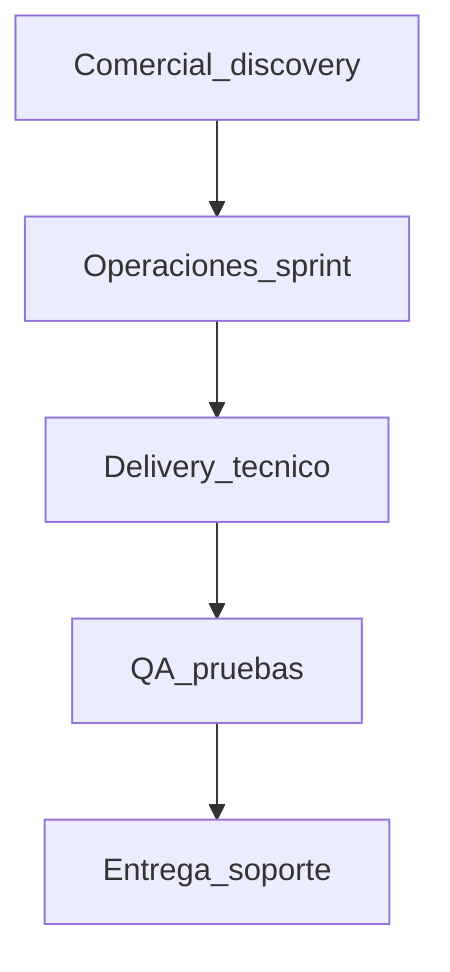
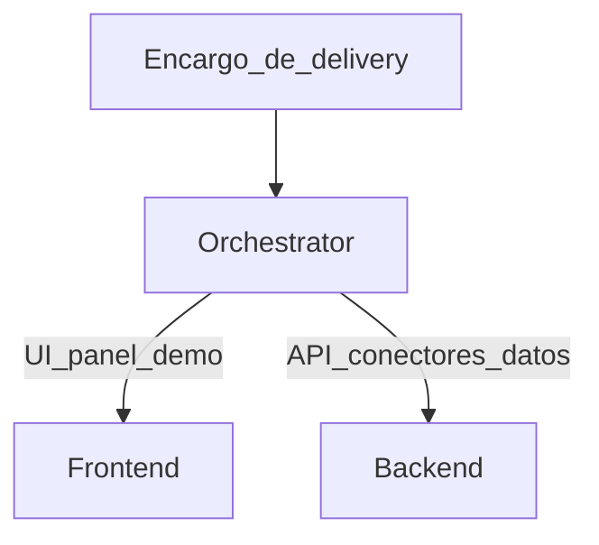

# Arquitectura de flujo — empresa vs delivery

Fuente de verdad del **dónde viven** Orchestrator, Frontend y Backend en la plataforma interna.

Norte de negocio: [docs/README.md](../README.md)  
Oferta vendible: [Sprint de Orquestación de Leads](../Orquestacion-Leads-Agencias/Oferta/Ofertas/Servicio-Profesional.md)

## Vista empresa

| Etapa | Qué hace (nicho) | Agentes típicos |
|---|---|---|
| Comercial / discovery | ICP-01, entrevistas, propuestas, cierre | `business` / sales (futuro) |
| Operaciones del sprint | Reglas de lead, CRM, canales, SLA, métricas | ops (futuro); knowledge del nicho |
| **Delivery técnico** | Construir/adaptar UI, API, conectores, paneles | **Orchestrator, Frontend, Backend** |
| QA / pruebas | Casos normales, duplicados, fallos, antes/después | QA (futuro) |
| Entrega / soporte | Handoff al cliente, incidencias, mantenimiento | support (futuro) |

## Vista delivery (subflujo)

Dentro de **Delivery técnico**, el flujo actual documentado en [fase_1/](fase_1/) es:

| Agente | Rol en el nicho |
|---|---|
| **Orchestrator** | Documenta el encargo (brief) y elige foco FE o BE. No orquesta toda la empresa. |
| **Frontend** | Paneles de excepciones, demos, UX del sprint / control operativo. |
| **Backend** | APIs, webhooks, integraciones CRM/canal, modelo de lead, alertas. |

Código legacy del repo puede seguir usando `developer` / `business` en el chat actual; el **modelo objetivo del módulo delivery** es Orchestrator + Frontend + Backend.

## Qué no es este diagrama

- No es el producto que se vende a la agencia (eso es el sprint de leads).
- No exige implementar todos los roles de empresa ahora.
- No pone a FE/BE como “la empresa completa”.

## Knowledge

El conocimiento de dominio debe apuntar al nicho (`Orquestacion-Leads-Agencias` → knowledge inmobiliario / orquestación de leads), no a `software_business` genérico ni a vacaciones.

## Relación con fases técnicas

| Doc | Alcance |
|---|---|
| Este archivo | Mapa empresa ↔ delivery |
| [fase_1/](fase_1/) | Contratos y stack del **módulo delivery** |
| [roadmap-fase_1.md](roadmap-fase_1.md) | Cómo crece la plataforma (knowledge, tools, memoria, multi-paso) |
