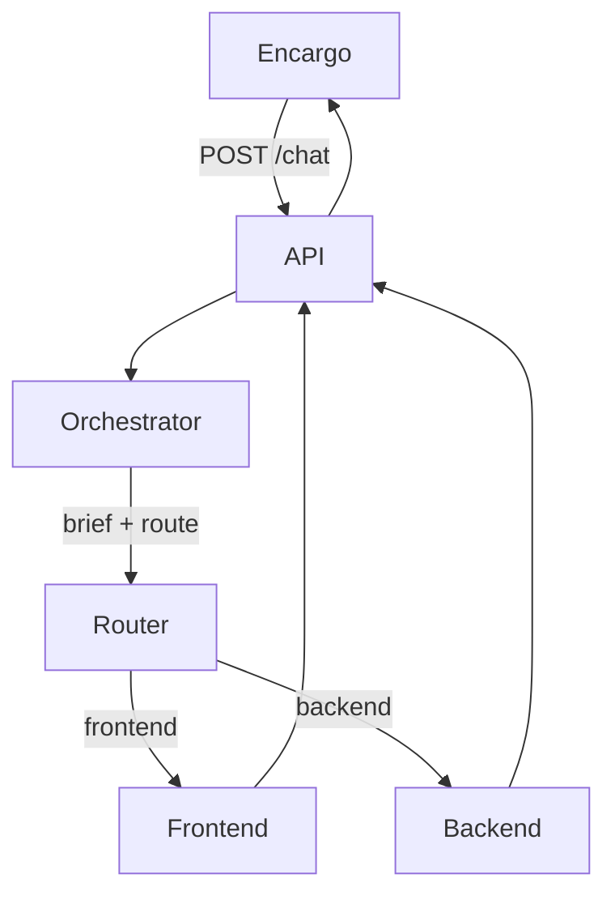

# Arquitectura — módulo delivery

Ubicación en la empresa: [arquitectura-flujo.md](../arquitectura-flujo.md).

## Flujo técnico (solo delivery)



1. Entra un **encargo de delivery** (no un “CEO chat” de toda la empresa).
2. La API carga el prompt del Orchestrator y llama al LLM.
3. Orchestrator → JSON: `agent` (`frontend`|`backend`), `reason`, `brief`.
4. El agente elegido recibe mensaje + `brief` y responde.
5. API → `routed_to`, `documentation`, `reply`, `reason`.

Sin bucles, memoria ni herramientas en esta base: un encargo → brief + una ruta → una respuesta.

## Mapa de carpetas (objetivo del módulo)

```
agents/
├── orchestrator/
│   └── system.md
├── frontend/
│   └── system.md
└── backend/
    └── system.md

api/
tests/
docs/
├── README.md
├── roadmap/producto.md
└── plataforma-interna/
    ├── README.md
    ├── arquitectura-flujo.md
    ├── roadmap-fase_1.md
    └── fase_1/                  # esta guía
```

Notas:

- Pueden coexistir `sales`, `ops`, `developer`, `business`, etc. Este módulo documenta el **subflujo delivery**.
- `knowledge/` del nicho (leads / agencias) se añade en fases posteriores; aún no es requisito de esta base.

## Capas mínimas de código

| Pieza | Responsabilidad |
|-------|-----------------|
| Carga de prompts | Leer `agents/<nombre>/system.md` |
| Cliente LLM | system + user → texto |
| Router | Orchestrator → parsear JSON → FE o BE |
| API | `POST /chat` documentar + implementar |

## Límite

“Brief → Frontend → Backend → unir” es multi-paso (más adelante). Roles de empresa fuera de delivery no se implementan en esta guía.
